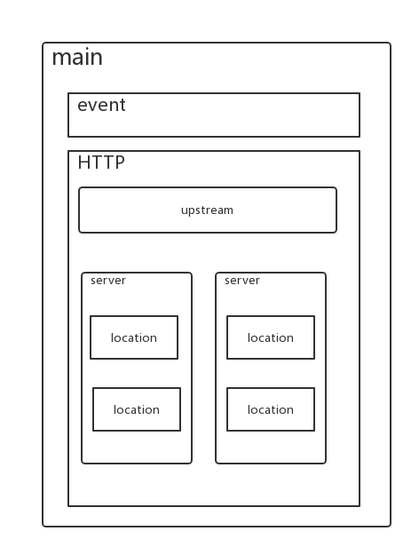

# 配置文件解读

nginx配置文件主要分为四个部分：

```text
main{ 
#（全局设置）
    http{ 
    #服务器
        upstream{} #（负载均衡服务器设置：主要用于负载均衡和设置一系列的后端服务器）
        server{ 
            #（主机设置：主要用于指定主机和端口）
            location{} #（URL匹配特点位置的设置）
        }
    }
}
```

server继承main，location继承server，upstream即不会继承其他设置也不会被继承。



## 一、main全局配置

用于设置运行时一些与具体业务无关的参数，如工作进程数，工作组等

```text
ser  www www;
worker_processes 4;
worker_cpu_affinity 0001 0010 0100 1000;
error_log  /var/logs/nginx_error.log  crit;
pid        /usr/local/webserver/nginx/nginx.pid;
worker_rlimit_nofile 65535;
```


* `user www www;`: 指定nginx进程使用什么用户启动
* `worker_processes 4;` : 指定启动多少进程来处理请求，一般情况下设置成CPU的核数，如果开启了ssl和gzip更应该设置成与逻辑CPU数量一样甚至为2倍，可以减少I/O操作。使用`grep ^processor /proc/cpuinfo | wc -l`查看CPU核数。
* `worker_cpu_affinity 0001 0010 0100 1000;`: 在高并发情况下，通过设置将CPU和具体的进程绑定来降低由于多核CPU切换造成的寄存器等现场重建带来的性能损耗。如worker\_cpu\_affinity 0001 0010 0100 1000; （四核）。
* `error_log /var/logs/nginx_error.log crit;`: error\_log是个主模块指令，用来定义全局错误日志文件。日志输出级别有debug、info、notice、warn、error、crit可供选择，其中，debug输出日志最为最详细，而crit输出日志最少。
* `pid /usr/local/webserver/nginx/nginx.pid;`: 指定进程pid文件的位置。
* `worker_rlimit_nofile 65535;`: 用于指定一个nginx进程可以打开的最多文件描述符数目，这里是65535，需要使用命令“ulimit -n 65535”来设置。

## 二、events模块

```bash
events{
  use epoll;
  worker_connections      65536;
}
```


* `use epoll;`use是个事件模块指令，用来指定Nginx的工作模式。Nginx支持的工作模式有select、poll、kqueue、epoll、rtsig和/dev/poll。其中select和poll都是标准的工作模式，kqueue和epoll是高效的工作模式，不同的是epoll用在Linux平台上，而kqueue用在BSD系统中。对于Linux系统，epoll工作模式是首选。在操作系统不支持这些高效模型时才使用select。
* `worker_connections 65536;`每一个worker进程能并发处理（发起）的最大连接数（包含与客户端或后端被代理服务器间等所有连接数）。nginx作为反向代理服务器，计算公式 `最大连接数 = worker_processes * worker_connections/4`，所以这里客户端最大连接数是65536，这个可以增到到8192都没关系，看情况而定，但不能超过后面的worker\_rlimit\_nofile。当nginx作为http服务器时，计算公式里面是除以2。进程的最大连接数受Linux系统进程的最大打开文件数限制，在执行操作系统命令`ulimit -n 65536`后`worker_connections`的设置才能生效。

## 三、http服务器

```text
http{
  include       mime.types;
  default_type  application/octet-stream;
  #charset  gb2312;
  }
```


* include是个主模块指令，实现对配置文件所包含的文件的设定，可以减少主配置文件的复杂度。类似于Apache中的include方法。
* default\_type属于HTTP核心模块指令，这里设定默认类型为二进制流，也就是当文件类型未定义时使用这种方式，例如在没有配置PHP环境时，Nginx是不予解析的，此时，用浏览器访问PHP文件就会出现下载窗口。
* charset gb2312; 指定客户端编码格式。

